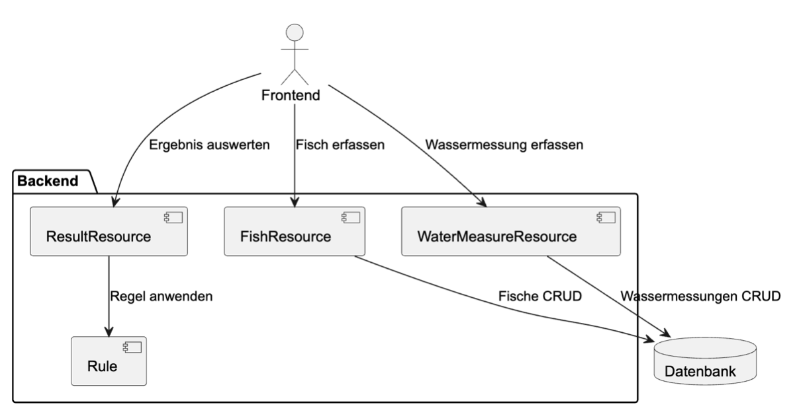
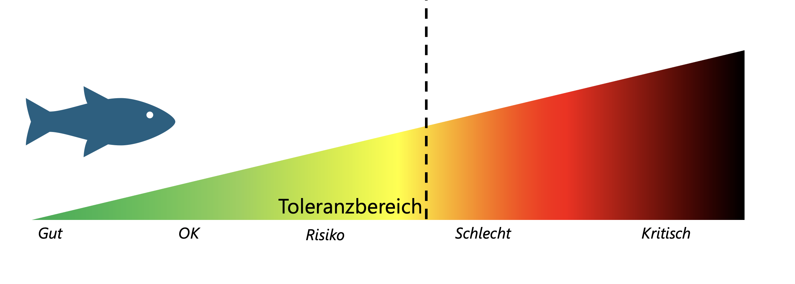

# The Aqualizer

This school project is based on the UN sustainability goal "Life Below Water". As part of the project, we took an in-depth look at various issues, including overfishing, ocean acidification, and water pollution.

A related problem is that the actual fish populations in different kinds of water are often not precisely known. That is why we addressed the fundamental question:

> **Is fish _x_ able to live in habitat _y_?**

For now, it remains unclear what type of water is involved. Possible examples include aquariums, ponds, river, lakes, or the ocean.

---

# Application Goal

The application is designed to enable users to:

- **Collect or import water data**
- **Define tolerance ranges for different fish species**
- **Evaluate compatibility between fish species and water conditions**

An overview of these functions is shown in the component diagram below:

---

# Application Features

This app offers the following features:

1. Record fish species and their respective tolerance ranges
2. Manually record water measurements
3. Import water data from a CSV file
4. Search for and filter water measurements
5. Select a fish species
6. Calculate compatibility between fish species and water measurements
7. Export analysis results as a CSV file

---

# Measurable Water Parameters

The app supports the recording of the following water parameters:

- **Water temperature**
- **Oxygen content**
- **Salinity**
- **pH level**

Tolerance ranges for these four parameters can be defined for each fish species.
---

# Assessment of Water Quality

Each fish species has a specific tolerance range within which it can survive. If the limits of this range are exceeded, the fish cannot survive in the long term.

To assess how well the environmental conditions suit a fish species, the calculation is based on the*mean value of the respective tolerance range.

Example:

If the measured pH value is 7, the system checks how close this value is to the optimal range (mean value) of the fish species’ tolerance range. This results in a rating ranging from **good** to **critical** in the following order:

- **good**
- **ok**
- **risky**
- **poor**
- **critical**